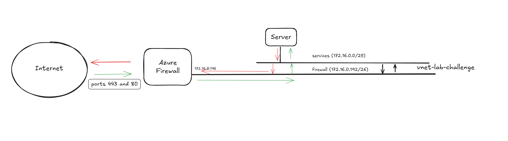

## Introduction

This is the deliverable for the **Senior Infrastructure Engineer Coding Challenge**.  
It consists of three different challenges, each one building upon the previous one.

The objective is to deploy enough infrastructure to host a web server using the **Mozilla Intermediate Cipher Suite Configuration**, placed behind a firewall.

There are two braches, developing , where tehre are all commits, and main, which is the ultime version.

---

## Architecture

### Resources deployed

- **UDR (User Defined Route)** to control outbound traffic  
- **Virtual Network (VNet)** with three subnets: *firewall*, *bastion*, and *services*  
- **Azure Firewall** with NAT and network rules to manage traffic flow  
- **Azure Bastion** for secure SSH/RDP connectivity  
- **Ubuntu Server** with the following features:
  - Apache installed and running  
  - Custom SSL certificates  
  - Configured with Mozilla Intermediate Cipher Suite  
  - An additional disk for web server document storage  

### Resources used

- **App Registration**  
- **User-Assigned Managed Identity**  
- **Azure Key Vault**, which stores:
  - The `CLIENT-ID`, `CLIENT-SECRET`, and `TENANT-ID` of the App Registration  
  - The web server SSL certificates (in `.pfx` format)  



---

## Functional Specifications

The **UDR** routes all outbound traffic to the **Azure Firewall** (default route `172.0.0.196`), while traffic within the VNet (`172.0.0.0/24`) is handled locally.

The **VNet** has three subnets:

- `services` → `172.16.0.0/25` (for the web server)  
- `AzureFirewallSubnet` → `172.16.0.192/25`  
- `AzureBastionSubnet` → `172.16.0.128/25`  

The **Azure Firewall** includes two rules:

- A **network rule** allowing all outbound TCP traffic to the Internet  
- A **DNAT rule** that forwards inbound traffic on ports 80 and 443 from the firewall’s public IP to the same ports on the web server  

> **Note:** In this lab environment, there is no rule denying all inbound traffic except ports 80 and 443.  
> However, in a production environment, you should explicitly deny all inbound traffic and only allow the ports required.

---

## Security

**Important:** The Azure Python SDK is used, but **not** for downloading the certificates directly.

- A **User-Assigned Managed Identity (UAMI)** is assigned to the server during deployment.  
- The script `get-secrets.py` uses the Azure Python SDK and the UAMI to connect to the **Key Vault** and retrieve the App Registration secrets and IDs, saving them temporarily.  
- The script `certificate.py` then uses these temporary values to authenticate as a **Service Principal** and download the certificate, fulfilling the challenge requirement without directly using the SDK for that part.

This approach avoids exposing sensitive credentials (such as the App Registration secret) in the codebase or repository.  
While it adds an extra step, it ensures better security practices, especially when the code is stored in a public GitHub repository.

The password of the server is choosen in the code, in server-params.json, after the deployment it should be changed.

---

## Code Structure

The `main.json` template uses **`parametersLink`** instead of inline `parameters`.  
This design choice improves **maintainability, scalability, and reusability**, but requires consistency across all parameter files.

For example:

```json
"vnetName": { "value": "vnet-lab-challenge1" },
"udrName": { "value": "udr-lab-challenge1" }
```

Additionally, because I cannot use parameters in main.json to pass outputs dynamically, I need to assign a fixed IP to the server.

This is necessary to configure the NAT firewall rule, since I need to know the server’s IP in advance. Alternatively, the NAT firewall rule could be applied directly in firewall.json instead of firewall-params.json, because the external IP of the firewall must be known beforehand.

Although this approach requires careful parameter alignment between templates, it’s still the preferred method for modular and maintainable ARM deployments.

Each challenge includes a CHANGELOG.md file explaining the files, modifications, and additions made.

## Deployment instructions 


```
az deployment sub create --location westeurope --template-file ./create-rg.json
az deployment group create --resource-group <name-resource-group> --template-file ./main.json
```


